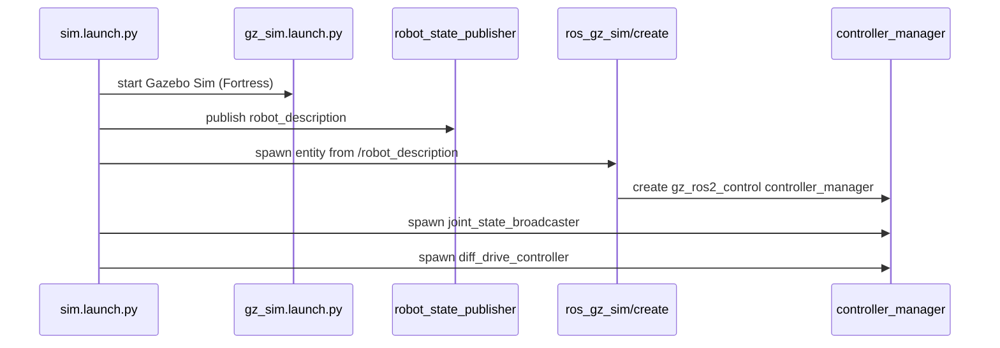

# My Robot (ROS 2 Humble + Ignition Fortress)

This package simulates a differential-drive robot in **Ignition Gazebo Fortress** with **ros2_control** (`gz_ros2_control`) and supports teleoperation.

## 1) Install Ignition Fortress and ROS integration

> Target OS: Ubuntu 22.04 + ROS 2 Humble.

### 1.1 Install required ROS 2 packages

```bash
sudo apt update
sudo apt install -y \
  ros-humble-ros-gz \
  ros-humble-ros-gz-sim \
  ros-humble-ros-gz-bridge \
  ros-humble-gz-ros2-control \
  ros-humble-ros2-control \
  ros-humble-ros2-controllers \
  ros-humble-diff-drive-controller \
  ros-humble-joint-state-broadcaster \
  ros-humble-xacro \
  ros-humble-robot-state-publisher \
  ros-humble-teleop-twist-keyboard
```

### 1.2 Install Ignition Fortress binaries

If `ign gazebo` is missing:

```bash
sudo apt update
sudo apt install -y ignition-fortress
```

Check:

```bash
ign gazebo --versions
```

## 2) Workspace workflow

### 2.1 Build and source

```bash
cd /home/rom/sim_ws
source /opt/ros/humble/setup.bash
colcon build --packages-select reeman_clone_description
source install/setup.bash
```

### 2.2 Launch simulation (one click)

```bash
ros2 launch reeman_clone_description sim.launch.py
```

Headless mode:

```bash
ros2 launch reeman_clone_description sim.launch.py gz_args:="-r -s empty.sdf"
```

### 2.3 Drive robot with keyboard

Open another terminal:

```bash
source /opt/ros/humble/setup.bash
source /home/rom/sim_ws/install/setup.bash
# ros2 run teleop_twist_keyboard teleop_twist_keyboard --ros-args -r cmd_vel:=/diff_drive_controller/cmd_vel_unstamped
ros2 run teleop_twist_keyboard teleop_twist_keyboard --ros-args -p stamped:=true -r cmd_vel:=/diff_drive_controller/cmd_vel
```

## 3) Architecture (Mermaid)

```mermaid
flowchart LR
  X[diffbot.urdf.xacro] --> RSP[robot_state_publisher]
  RSP -->|robot_description| SPAWN[ros_gz_sim create]
  GZ[Ignition Fortress / Gazebo Sim] --> CM[/controller_manager]
  SPAWN --> GZ
  CFG[diff_drive_controller.yaml] --> GZCTRL[gz_ros2_control plugin]
  GZCTRL --> CM
  CM --> JSB[joint_state_broadcaster]
  CM --> DDC[diff_drive_controller]
  TEL[teleop_twist_keyboard] -->|cmd_vel| DDC
  DDC -->|wheel velocity cmds| GZ
```



## 4) How URDF is connected to Ignition and ros2_control

### 4.1 ros2_control block in URDF/Xacro

Inside `urdf/diffbot.urdf.xacro`:

```xml
<ros2_control name="DiffBotSystem" type="system">
  <hardware>
    <plugin>gz_ros2_control/GazeboSimSystem</plugin>
  </hardware>
  <joint name="left_wheel_joint">
    <command_interface name="velocity"/>
    <state_interface name="position"/>
    <state_interface name="velocity"/>
  </joint>
  <joint name="right_wheel_joint">
    <command_interface name="velocity"/>
    <state_interface name="position"/>
    <state_interface name="velocity"/>
  </joint>
</ros2_control>
```

### 4.2 Gazebo plugin that starts controller_manager

```xml
<gazebo>
  <plugin filename="gz_ros2_control-system" name="gz_ros2_control::GazeboSimROS2ControlPlugin">
    <parameters>$(find reeman_clone_description)/config/diff_drive_controller.yaml</parameters>
  </plugin>
</gazebo>
```

### 4.3 Controller config file

`config/diff_drive_controller.yaml` contains:

- `controller_manager.ros__parameters` (declares controllers)
- `joint_state_broadcaster`
- `diff_drive_controller` parameters (wheel names, radius, separation, limits)

## 5) Add sensors (LiDAR, IMU, 3D camera)

Add sensor links + fixed joints, then add `<gazebo reference="...">` sensor blocks.

### 5.1 LiDAR example

```xml
<link name="lidar_link">
  <visual>
    <geometry><cylinder radius="0.03" length="0.04"/></geometry>
  </visual>
</link>

<joint name="lidar_joint" type="fixed">
  <parent link="base_link"/>
  <child link="lidar_link"/>
  <origin xyz="0.10 0.0 0.12" rpy="0 0 0"/>
</joint>

<gazebo reference="lidar_link">
  <sensor name="lidar_sensor" type="gpu_lidar">
    <always_on>true</always_on>
    <update_rate>20</update_rate>
    <topic>lidar/scan</topic>
    <gz_frame_id>lidar_link</gz_frame_id>
    <lidar>
      <scan>
        <horizontal>
          <samples>720</samples>
          <resolution>1</resolution>
          <min_angle>-3.14159</min_angle>
          <max_angle>3.14159</max_angle>
        </horizontal>
      </scan>
      <range>
        <min>0.12</min>
        <max>12.0</max>
        <resolution>0.01</resolution>
      </range>
    </lidar>
  </sensor>
</gazebo>
```

### 5.2 IMU example

```xml
<link name="imu_link"/>

<joint name="imu_joint" type="fixed">
  <parent link="base_link"/>
  <child link="imu_link"/>
  <origin xyz="0 0 0.08" rpy="0 0 0"/>
</joint>

<gazebo reference="imu_link">
  <sensor name="imu_sensor" type="imu">
    <always_on>true</always_on>
    <update_rate>100</update_rate>
    <topic>imu/data</topic>
    <gz_frame_id>imu_link</gz_frame_id>
  </sensor>
</gazebo>
```

### 5.3 3D camera (RGB-D) example

```xml
<link name="camera_link">
  <visual>
    <geometry><box size="0.04 0.04 0.03"/></geometry>
  </visual>
</link>

<joint name="camera_joint" type="fixed">
  <parent link="base_link"/>
  <child link="camera_link"/>
  <origin xyz="0.15 0 0.14" rpy="0 0 0"/>
</joint>

<gazebo reference="camera_link">
  <sensor name="rgbd_camera" type="rgbd_camera">
    <always_on>true</always_on>
    <update_rate>15</update_rate>
    <topic>camera</topic>
    <gz_frame_id>camera_link</gz_frame_id>
    <camera>
      <horizontal_fov>1.047</horizontal_fov>
      <image>
        <width>640</width>
        <height>480</height>
        <format>R8G8B8</format>
      </image>
      <clip>
        <near>0.1</near>
        <far>10.0</far>
      </clip>
    </camera>
  </sensor>
</gazebo>
```

## 6) Bridge Ignition sensor topics to ROS 2

Use `ros_gz_bridge`:

```bash
ros2 run ros_gz_bridge parameter_bridge \
  /lidar/scan@sensor_msgs/msg/LaserScan[gz.msgs.LaserScan \
  /imu/data@sensor_msgs/msg/Imu[gz.msgs.IMU \
  /camera/image@sensor_msgs/msg/Image[gz.msgs.Image \
  /camera/depth_image@sensor_msgs/msg/Image[gz.msgs.Image \
  /camera/camera_info@sensor_msgs/msg/CameraInfo[gz.msgs.CameraInfo
```

Tip: inspect actual Gazebo topic names first:

```bash
ign topic -l
```

Then match each bridge rule to real topic names.

## 7) Files in this package

- `launch/sim.launch.py`: one-click simulation launch
- `launch/sim_1.launch.py`: wrapper launch
- `urdf/diffbot.urdf.xacro`: robot model + `gz_ros2_control` plugin
- `config/diff_drive_controller.yaml`: controllers config

## 8) Troubleshooting

- `spawner ... waiting for /controller_manager/...`:
  - Gazebo process exited, or `gz_ros2_control` plugin failed to load.
  - Check URDF plugin filename is `gz_ros2_control-system`.
- `libEGL ... failed to create dri2 screen`:
  - Run headless with `gz_args:="-r -s empty.sdf"`.
- No robot spawned:
  - Verify `/robot_description` exists and `ros_gz_sim create` is called.

